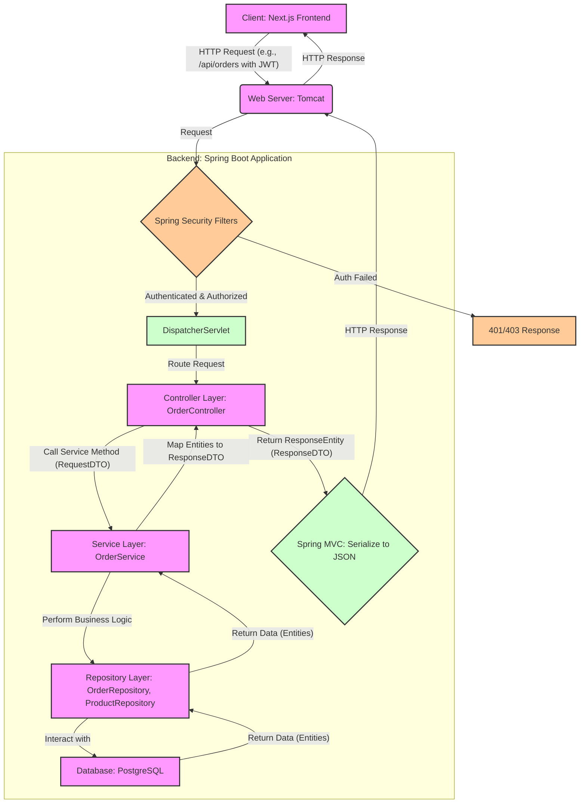

# Backend Data Flow Guide: E-commerce System

## 1. Introduction

This document provides a detailed explanation of the backend data processing flow for our e-commerce web system. The system is built with a Spring Boot backend and a Next.js frontend.

**Tech Stack Overview:**

*   **Backend:** Spring Boot (Java)
    *   Spring MVC for REST APIs
    *   Spring Data JPA for database interaction
    *   Spring Security for authentication and authorization
    *   PostgreSQL (or similar relational database)
*   **Frontend:** Next.js (React)
    *   Axios or Fetch for API communication

**Focus of this Document:**

The primary goal of this guide is to help computer science students, particularly those preparing for system defense, understand how data flows through the backend. We will explore how user requests from the Next.js frontend are received, processed by various layers of the Spring Boot application, and how responses are sent back. This includes looking at data transformation, security enforcement, and database interactions.

## 2. Overview of Backend Architecture

A typical Spring Boot project follows a standard directory structure that promotes modularity and maintainability. Understanding this structure is key to navigating the codebase. The main application code is usually found under `src/main/java/com/yourcompany/yourproject/`.

Here's a breakdown of common core packages and their purposes:

*   **`com.espressionist.controller` (or `com.espressionist.web.rest`)**:
    *   **Purpose**: Handles incoming HTTP requests from the frontend (or other clients). Controllers are the entry point for client interactions.
    *   **Content**: Contains classes annotated with `@RestController` or `@Controller`. Methods in these classes are mapped to specific URL endpoints (e.g., `/api/products`, `/api/auth/login`).
    *   **Responsibility**: To receive requests, validate basic input (sometimes), delegate business logic to Service layer, and return an HTTP response (often in JSON format).
    *   *Example File*: `ProductController.java`

*   **`com.espressionist.service`**:
    *   **Purpose**: Contains the core business logic of the application. It acts as an intermediary between controllers and repositories.
    *   **Content**: Interface and implementation classes (e.g., `ProductService.java`, `ProductServiceImpl.java`).
    *   **Responsibility**: To perform complex calculations, data manipulation, transaction management, and coordinate calls to various repositories or other services.
    *   *Example File*: `OrderService.java`

*   **`com.espressionist.repository` (or `com.espressionist.dao`)**:
    *   **Purpose**: Responsible for data access and persistence. It interacts directly with the database.
    *   **Content**: Interfaces that extend Spring Data JPA interfaces like `JpaRepository` or `CrudRepository` (e.g., `ProductRepository.java`).
    *   **Responsibility**: To perform CRUD (Create, Read, Update, Delete) operations on database entities. Spring Data JPA automatically generates implementations for basic queries. Custom queries can be defined using `@Query` annotation or by naming conventions.
    *   *Example File*: `UserRepository.java`

*   **`com.espressionist.model` (or `com.espressionist.entity`, `com.espressionist.domain`)**:
    *   **Purpose**: Defines the data structures that map to database tables. These are Plain Old Java Objects (POJOs) representing the application's domain.
    *   **Content**: Classes annotated with `@Entity` (JPA annotation) that represent database tables. Fields in these classes correspond to table columns.
    *   **Responsibility**: To represent the persistent data of the application.
    *   *Example File*: `Product.java`, `User.java`, `Order.java`

*   **`com.espressionist.dto` (Data Transfer Object)**:
    *   **Purpose**: Simple objects used to transfer data between layers, especially between the service layer and the controller layer, and ultimately to/from the client. They help in decoupling service layer logic from controller layer API contracts and can be tailored to specific frontend needs.
    *   **Content**: POJOs that are typically simpler than entities and may combine data from multiple entities or present a subset of an entity's data.
    *   **Responsibility**: To carry data. Often used to shape the JSON request and response payloads.
    *   *Example File*: `ProductDTO.java`, `UserLoginDTO.java`

*   **`com.espressionist.config`**:
    *   **Purpose**: Contains configuration classes for various aspects of the application, such as security, database connections, beans, etc.
    *   **Content**: Classes annotated with `@Configuration`. These classes define beans (`@Bean`) that Spring manages.
    *   **Responsibility**: To set up and customize the application's behavior and infrastructure.
    *   *Example File*: `SecurityConfig.java`, `WebConfig.java`

*   **`com.espressionist.security`**:
    *   **Purpose**: Specifically handles security-related concerns like authentication, authorization, and session management.
    *   **Content**: Often includes implementations for Spring Security's `UserDetailsService`, JWT (JSON Web Token) utilities, security filters, and configuration related to security rules.
    *   **Responsibility**: To protect application resources and ensure only authorized users can access certain functionalities.
    *   *Example File*: `JwtTokenProvider.java`, `UserDetailsServiceImpl.java`

*   **`com.espressionist.exception` (or `com.espressionist.advice`)**:
    *   **Purpose**: Defines custom exception classes and global exception handlers.
    *   **Content**: Custom exception classes (e.g., `ResourceNotFoundException.java`) and classes annotated with `@ControllerAdvice` to handle exceptions globally.
    *   **Responsibility**: To manage error handling in a consistent way across the application, providing meaningful error responses to the client.
    *   *Example File*: `GlobalExceptionHandler.java`

*   **`src/main/resources`**:
    *   **`application.properties` or `application.yml`**: Main configuration file for database connections, server port, logging levels, and other application settings.
    *   **`static`**: For static assets like HTML, CSS, JavaScript if not using a separate frontend framework like Next.js (less relevant in our Next.js integrated setup for backend-only assets).
    *   **`templates`**: For server-side rendered templates (e.g., Thymeleaf), also less relevant when Next.js handles the UI.

This layered architecture helps in separating concerns, making the application easier to test, maintain, and scale. Each layer has a distinct responsibility, reducing coupling between different parts of the system.

## 3. Frontend to Backend Flow

Understanding how the frontend (Next.js) communicates with the backend (Spring Boot) is crucial. Here's a typical sequence of events when a user interacts with the e-commerce system, for example, when a customer clicks "Add to Cart" or an admin tries to view all orders.

1.  **Frontend Trigger (User Action)**:
    *   A user performs an action in the Next.js application, such as clicking a button (e.g., "Login", "View Product Details", "Place Order"), submitting a form, or even navigating to a new page that requires data from the backend.

2.  **API Call from Frontend (Next.js)**:
    *   The Next.js application uses JavaScript's `fetch` API or a library like `axios` to make an HTTP request to a specific backend API endpoint.
    *   This request includes:
        *   **HTTP Method**: `GET` (to retrieve data), `POST` (to create data), `PUT` (to update data), `DELETE` (to remove data).
        *   **URL**: The backend endpoint, e.g., `https://api.yourecommerce.com/api/products/123` or `/api/orders`.
        *   **Headers**: May include authentication tokens (like a JWT in the `Authorization` header), `Content-Type` (e.g., `application/json`).
        *   **Body (Payload)**: For `POST` or `PUT` requests, this contains the data to be sent to the backend, usually in JSON format (e.g., login credentials, product details, order information).

    ```javascript
    // Example: Fetching product details in Next.js using axios
    import axios from 'axios';

    async function getProductDetails(productId) {
      try {
        const response = await axios.get(`/api/products/${productId}`, {
          headers: {
            'Authorization': `Bearer ${localStorage.getItem('authToken')}` // If auth is needed
          }
        });
        return response.data; // The product data from the backend
      } catch (error) {
        console.error("Error fetching product:", error);
        // Handle error (e.g., show a message to the user)
      }
    }
    ```

3.  **Backend Controller Method Execution (Spring Boot)**:
    *   The Spring Boot application's embedded web server (e.g., Tomcat) receives the HTTP request.
    *   Spring MVC's `DispatcherServlet` routes the request to the appropriate `@RestController` class and method based on the URL pattern (e.g., `@GetMapping("/products/{id}")`) and HTTP method.
    *   If security is enabled, Spring Security filters intercept the request first to check authentication and authorization (more on this in Section 6).
    *   Path variables (like `{id}`), request parameters (`@RequestParam`), and request body (`@RequestBody`) are mapped to method parameters.

    ```java
    // Example: ProductController.java
    @RestController
    @RequestMapping("/api/products")
    public class ProductController {
        @Autowired
        private ProductService productService;

        @GetMapping("/{id}")
        public ResponseEntity<ProductDTO> getProductById(@PathVariable Long id) {
            ProductDTO product = productService.findProductById(id);
            return ResponseEntity.ok(product);
        }
    }
    ```

4.  **Service Layer Logic**:
    *   The controller delegates the actual processing to a method in a `@Service` class (e.g., `productService.findProductById(id)`).
    *   The service layer contains the core business logic. It might:
        *   Perform validation (beyond basic input validation).
        *   Orchestrate calls to one or more repository methods.
        *   Apply business rules (e.g., check if a product is in stock before adding to cart, calculate total order price).
        *   Transform data between different formats if needed.
        *   Manage transactions (e.g., ensure an order and its payment are processed atomically).

5.  **Repository/DAO Access to the Database**:
    *   The service layer calls methods on a `@Repository` interface (e.g., `productRepository.findById(id)`).
    *   Spring Data JPA provides the implementation for these repository interfaces. It translates the method call into a database query (e.g., SQL `SELECT * FROM products WHERE id = ?`).
    *   The repository interacts with the database (e.g., PostgreSQL) via JDBC and a connection pool.
    *   Data is retrieved from the database and mapped to JPA `@Entity` objects (e.g., `Product` entity).

6.  **Entity Mapping and DTO Response**:
    *   The data retrieved from the database (as Entities) is often mapped to Data Transfer Objects (DTOs) before being sent back to the controller.
    *   This mapping (e.g., from `Product` entity to `ProductDTO`) can be done manually or using a library like ModelMapper. DTOs are useful for:
        *   Shaping the response specifically for the frontend's needs.
        *   Avoiding exposure of internal entity structures.
        *   Preventing issues like lazy loading exceptions when serializing entities to JSON.
    *   The service layer returns the DTO (or a list of DTOs) to the controller.

7.  **Returning Response Back to the Frontend**:
    *   The controller receives the DTO from the service layer.
    *   It wraps the DTO in a `ResponseEntity` to include HTTP status codes (e.g., `200 OK`, `404 Not Found`, `401 Unauthorized`) and headers.
    *   Spring MVC, with the help of libraries like Jackson, automatically serializes the DTO into a JSON string (or other configured format).
    *   The HTTP response (containing the JSON data and status code) is sent back to the Next.js frontend.

8.  **Frontend Processes the Response**:
    *   The `axios` or `fetch` call in the Next.js application resolves its promise with the response from the backend.
    *   The frontend JavaScript code then processes this data:
        *   Updates the UI to display the new information (e.g., show product details, update cart count).
        *   Stores data in component state or a global state management solution (like Redux or Zustand).
        *   Handles any errors based on the HTTP status code or error message in the response.

This flow ensures a clear separation of concerns, where the frontend handles user interaction and presentation, while the backend manages business logic, data persistence, and security. Error handling is also a part of this flow; if any step in the backend fails (e.g., product not found, database error, validation error), an appropriate error response (e.g., 404, 500, 400) is sent back, which the frontend should handle gracefully.

## 4. Layer-by-Layer Breakdown

Let's dive deeper into each layer of the Spring Boot backend.

### 4.1. Controller Layer

*   **Purpose**:
    *   The Controller layer is the first point of contact for incoming HTTP requests from the client (Next.js frontend).
    *   It's responsible for interpreting these requests, extracting necessary data (like path variables, request parameters, and request bodies), and then delegating the actual business logic processing to the Service layer.
    *   Finally, it takes the result from the Service layer, formats it into an HTTP response (often JSON), and sends it back to the client.

*   **Example Methods and Their Role**:
    *   `@GetMapping("/products")`: Retrieves a list of all products.
    *   `@GetMapping("/products/{id}")`: Retrieves a specific product by its ID.
    *   `@PostMapping("/orders")`: Creates a new order.
    *   `@PutMapping("/users/{userId}/profile")`: Updates a user's profile.
    *   `@DeleteMapping("/cart/items/{itemId}")`: Removes an item from the shopping cart.

    ```java
    // File: /backend/src/main/java/com/espressionist/controller/OrderController.java
    package com.espressionist.controller;

    import com.espressionist.dto.OrderDTO;
    import com.espressionist.dto.CreateOrderRequestDTO;
    import com.espressionist.service.OrderService;
    import org.springframework.beans.factory.annotation.Autowired;
    import org.springframework.http.HttpStatus;
    import org.springframework.http.ResponseEntity;
    import org.springframework.web.bind.annotation.*;
    import java.util.List;

    @RestController
    @RequestMapping("/api/orders")
    public class OrderController {

        @Autowired
        private OrderService orderService;

        // Role: Endpoint to create a new order
        @PostMapping
        public ResponseEntity<OrderDTO> createOrder(@RequestBody CreateOrderRequestDTO orderRequest) {
            // Delegates to OrderService to handle business logic
            OrderDTO createdOrder = orderService.placeOrder(orderRequest);
            return new ResponseEntity<>(createdOrder, HttpStatus.CREATED);
        }

        // Role: Endpoint to get orders for the authenticated user
        @GetMapping("/my-orders")
        public ResponseEntity<List<OrderDTO>> getCurrentUserOrders() {
            // Assumes user information is retrieved from security context by the service
            List<OrderDTO> orders = orderService.getOrdersForCurrentUser();
            return ResponseEntity.ok(orders);
        }

        // Role: Endpoint for an admin to get a specific order by ID
        @GetMapping("/{orderId}")
        // @PreAuthorize("hasRole('ADMIN')") // Example of security
        public ResponseEntity<OrderDTO> getOrderById(@PathVariable Long orderId) {
            OrderDTO order = orderService.getOrderDetails(orderId);
            return ResponseEntity.ok(order);
        }
    }
    ```

*   **How this layer transforms or manipulates data**:
    *   **Input**: Receives raw HTTP request data (JSON body, URL parameters, headers). Spring MVC automatically deserializes JSON into Java objects (like DTOs specified with `@RequestBody`).
    *   **Output**: Takes Java objects (usually DTOs) returned by the Service layer and serializes them into a JSON HTTP response. It also sets HTTP status codes and headers.
    *   Minimal data manipulation occurs here; its main job is routing and data format conversion for transport.

*   **When this layer executes in a typical request**:
    *   It's the **first layer** of your application code to execute after the request passes through the web server (e.g., Tomcat) and any configured Spring Boot/Spring Security filters.

*   **List relevant files in this layer with short explanations**:
    *   `com/espressionist/controller/ProductController.java`: Handles requests related to products (view, list, etc.).
    *   `com/espressionist/controller/OrderController.java`: Manages order creation, viewing order history, etc.
    *   `com/espressionist/controller/AuthController.java`: Handles user authentication (login, registration) and token issuance.
    *   `com/espressionist/controller/UserController.java`: Manages user profile updates, admin user management.

### 4.2. Service Layer

*   **Purpose**:
    *   The Service layer contains the core business logic of the application.
    *   It orchestrates operations, enforces business rules, manages transactions, and acts as a bridge between the Controller layer and the Repository layer.
    *   It's designed to be independent of the web layer, meaning it could theoretically be reused by different types of controllers or entry points.

*   **Example Methods and Their Role**:
    *   `placeOrder(CreateOrderRequestDTO orderRequest)`: Validates order details, checks product availability, calculates totals, saves the order, and potentially initiates payment processing.
    *   `findProductById(Long id)`: Retrieves a product, possibly checking for active status or applying visibility rules.
    *   `registerUser(UserRegistrationDTO registrationDTO)`: Validates user data, checks for existing users, hashes the password, and saves the new user.
    *   `updateProductStock(Long productId, int quantityChange)`: Updates the stock level for a product, ensuring it doesn't go negative.

    ```java
    // File: /backend/src/main/java/com/espressionist/service/ProductServiceImpl.java
    package com.espressionist.service;

    import com.espressionist.dto.ProductDTO;
    import com.espressionist.entity.Product;
    import com.espressionist.repository.ProductRepository;
    import com.espressionist.exception.ResourceNotFoundException;
    import org.modelmapper.ModelMapper; // Or manual mapping
    import org.springframework.beans.factory.annotation.Autowired;
    import org.springframework.stereotype.Service;
    import org.springframework.transaction.annotation.Transactional; // Important for data consistency
    import java.util.List;
    import java.util.stream.Collectors;

    @Service
    public class ProductServiceImpl implements ProductService {

        @Autowired
        private ProductRepository productRepository;

        @Autowired
        private ModelMapper modelMapper; // For DTO-Entity mapping

        // Role: Retrieve a product by its ID and map it to a DTO
        @Override
        public ProductDTO findProductById(Long id) {
            Product product = productRepository.findById(id)
                .orElseThrow(() -> new ResourceNotFoundException("Product not found with id: " + id));
            // Business logic: e.g., check if product is active before returning
            // if (!product.isActive()) { throw new ProductNotAvailableException("Product is currently unavailable"); }
            return modelMapper.map(product, ProductDTO.class);
        }

        // Role: Retrieve all products, potentially with filtering/pagination
        @Override
        public List<ProductDTO> findAllProducts() {
            List<Product> products = productRepository.findAll();
            return products.stream()
                .map(product -> modelMapper.map(product, ProductDTO.class))
                .collect(Collectors.toList());
        }

        // Role: Example of a transactional method to create a product
        @Override
        @Transactional // Ensures atomicity: either all db operations succeed or none do
        public ProductDTO createProduct(ProductDTO productDTO) {
            // Business logic: e.g., validation, default value setting
            Product product = modelMapper.map(productDTO, Product.class);
            // product.setCreatedAt(LocalDateTime.now()); // Example
            Product savedProduct = productRepository.save(product);
            return modelMapper.map(savedProduct, ProductDTO.class);
        }
    }
    ```

*   **How this layer transforms or manipulates data**:
    *   **Input**: Receives DTOs or primitive types from the Controller.
    *   **Processing**:
        *   Transforms DTOs into Entities to be persisted by the Repository layer.
        *   Retrieves Entities from the Repository layer and maps them back to DTOs to be returned to the Controller.
        *   Performs calculations (e.g., order totals, discounts).
        *   Enforces business rules (e.g., user permissions, inventory checks).
    *   **Output**: Returns DTOs or simple types to the Controller.

*   **When this layer executes in a typical request**:
    *   Executes **after** the Controller layer has received and validated the initial request.
    *   Executes **before** any data is sent back through the Controller layer.

*   **List relevant files in this layer with short explanations**:
    *   `com/espressionist/service/ProductService.java` (Interface) & `ProductServiceImpl.java` (Implementation): Business logic for product management.
    *   `com/espressionist/service/OrderService.java` & `OrderServiceImpl.java`: Handles order processing, history, and status updates.
    *   `com/espressionist/service/UserService.java` & `UserServiceImpl.java`: User registration, profile management logic.
    *   `com/espressionist/service/PaymentService.java` (if applicable): Integrates with payment gateways.

### 4.3. Repository Layer

*   **Purpose**:
    *   The Repository layer (also known as Data Access Object or DAO layer) is responsible for all database interactions.
    *   It abstracts the underlying data storage mechanism (e.g., SQL database) from the rest of the application.
    *   Spring Data JPA makes this layer very easy to implement by providing interfaces like `JpaRepository` which automatically generate common CRUD operations.

*   **Example Methods and Their Role**:
    *   `findById(Long id)`: Retrieves an entity by its primary key.
    *   `findAll()`: Retrieves all entities of a certain type.
    *   `save(Entity entity)`: Saves a new entity or updates an existing one.
    *   `deleteById(Long id)`: Deletes an entity by its primary key.
    *   Custom query methods: `findByCategory(String category)` or `@Query("SELECT p FROM Product p WHERE p.price > :minPrice")`.

    ```java
    // File: /backend/src/main/java/com/espressionist/repository/ProductRepository.java
    package com.espressionist.repository;

    import com.espressionist.model.Product; // Assuming Product is an @Entity
    import org.springframework.data.jpa.repository.JpaRepository;
    import org.springframework.data.jpa.repository.Query;
    import org.springframework.stereotype.Repository;
    import java.util.List;
    import java.util.Optional;

    @Repository
    public interface ProductRepository extends JpaRepository<Product, Long> { // Product is the Entity, Long is its ID type

        // Spring Data JPA automatically provides: save(), findById(), findAll(), deleteById(), etc.

        // Role: Custom query method to find products by category name
        // Spring Data JPA will generate the query based on the method name
        List<Product> findByCategoryNameIgnoreCase(String categoryName);

        // Role: Custom query using JPQL (Java Persistence Query Language)
        @Query("SELECT p FROM Product p WHERE p.price < :maxPrice AND p.inStock = true")
        List<Product> findAvailableProductsCheaperThan(double maxPrice);

        // Role: Find a product by its unique SKU (Stock Keeping Unit)
        Optional<Product> findBySku(String sku);
    }
    ```

*   **How this layer transforms or manipulates data**:
    *   **Input**: Receives Entity objects from the Service layer (for saving/updating) or query parameters (for finding).
    *   **Processing**:
        *   Maps Entity objects to database records when saving/updating.
        *   Maps database records to Entity objects when retrieving data.
        *   Executes SQL queries (often generated by Spring Data JPA) against the database.
    *   **Output**: Returns Entity objects (or collections of Entities, or simple types for projection queries) to the Service layer.

*   **When this layer executes in a typical request**:
    *   Executes when called by the Service layer to persist or retrieve data. It's typically one of the last layers in the outbound flow of a request (before data is returned up the chain) or an intermediate step if multiple data access operations are needed.

*   **List relevant files in this layer with short explanations**:
    *   `com/espressionist/repository/ProductRepository.java`: Data access operations for `Product` entities.
    *   `com/espressionist/repository/OrderRepository.java`: Data access for `Order` entities.
    *   `com/espressionist/repository/UserRepository.java`: Data access for `User` entities.
    *   `com/espressionist/repository/OrderItemRepository.java`: Data access for `OrderItem` entities (lines within an order).

### 4.4. Model/Entity Layer

*   **Purpose**:
    *   This layer defines the structure of the data that the application works with, specifically the data that is persisted in the database.
    *   Entities are Plain Old Java Objects (POJOs) annotated with JPA (Java Persistence API) annotations like `@Entity`, `@Table`, `@Id`, `@Column`, `@ManyToOne`, etc.
    *   They represent the tables in your relational database.

*   **Example "Methods" (Fields and Annotations) and Their Role**:
    *   `@Entity`: Marks a class as a JPA entity (i.e., mapped to a database table).
    *   `@Table(name = "products")`: Specifies the database table name.
    *   `@Id @GeneratedValue(strategy = GenerationType.IDENTITY)`: Defines the primary key for the entity, often auto-generated.
    *   `@Column(name = "product_name", nullable = false)`: Maps a field to a database column with specific constraints.
    *   `@ManyToOne`, `@OneToMany`, `@ManyToMany`: Define relationships between entities.

    ```java
    // File: /backend/src/main/java/com/espressionist/model/Product.java
    package com.espressionist.model;

    import javax.persistence.*; // JPA annotations
    import java.math.BigDecimal;
    import java.time.LocalDateTime;
    // import java.util.List; // For relationships

    @Entity
    @Table(name = "products") // Maps this class to the "products" table in the DB
    public class Product {

        @Id
        @GeneratedValue(strategy = GenerationType.IDENTITY) // Auto-incrementing ID
        private Long id;

        @Column(name = "name", nullable = false, length = 255)
        private String name;

        @Lob // For large text fields
        @Column(name = "description")
        private String description;

        @Column(name = "price", nullable = false, precision = 10, scale = 2)
        private BigDecimal price;

        @Column(name = "stock_quantity", nullable = false)
        private int stockQuantity;

        @Column(name = "sku", unique = true, nullable = false)
        private String sku; // Stock Keeping Unit

        @Column(name = "image_url")
        private String imageUrl;

        @Column(name = "is_active", nullable = false)
        private boolean isActive = true;

        // Example of a relationship (e.g., a product belongs to a category)
        // @ManyToOne(fetch = FetchType.LAZY) // LAZY is often preferred for performance
        // @JoinColumn(name = "category_id", nullable = false)
        // private Category category;

        // Timestamps
        @Column(name = "created_at", updatable = false)
        private LocalDateTime createdAt;

        @Column(name = "updated_at")
        private LocalDateTime updatedAt;

        @PrePersist // JPA callback before persisting
        protected void onCreate() {
            createdAt = LocalDateTime.now();
            updatedAt = LocalDateTime.now();
        }

        @PreUpdate // JPA callback before updating
        protected void onUpdate() {
            updatedAt = LocalDateTime.now();
        }

        // Constructors, Getters, Setters, equals(), hashCode(), toString() ...
        // Often generated by Lombok (@Data, @Getter, @Setter, etc.) or IDEs
    }
    ```

*   **How this layer transforms or manipulates data**:
    *   This layer primarily *represents* data. It doesn't actively transform data in the same way services or controllers do.
    *   JPA provider (e.g., Hibernate) uses these entity definitions to map data to and from the database.
    *   It can contain lifecycle callbacks (`@PrePersist`, `@PostLoad`, etc.) for simple default value setting or logging.
    *   May contain helper methods related to the entity's state, but complex business logic should be in the Service layer.

*   **When this layer executes in a typical request**:
    *   Entities are instantiated by the Repository layer when data is fetched from the database.
    *   Entities are created or modified by the Service layer before being passed to the Repository for persistence.
    *   They are "active" whenever data related to them is being handled.

*   **List relevant files in this layer with short explanations**:
    *   `com/espressionist/model/Product.java`: Defines the structure of a product.
    *   `com/espressionist/model/User.java`: Defines user account information, roles.
    *   `com/espressionist/model/Order.java`: Represents a customer's order.
    *   `com/espressionist/model/OrderItem.java`: Represents an individual item within an order.
    *   `com/espressionist/model/Category.java`: Defines product categories.
    *   `com/espressionist/model/Role.java`: Defines user roles (ADMIN, CUSTOMER).

### 4.5. DTO (Data Transfer Object) Layer

*   **Purpose**:
    *   DTOs are simple objects used to transfer data between layers, most commonly between the Service layer and the Controller layer, and thus between the backend and the frontend.
    *   They help in decoupling the API contract (what the frontend expects/sends) from the internal database structure (Entities).
    *   They can be tailored for specific use cases, sending only necessary data or aggregating data from multiple entities.

*   **Example "Methods" (Fields) and Their Role**:
    *   DTOs are typically POJOs with fields, constructors, getters, and setters. They usually don't contain business logic.
    *   `ProductDTO`: Might include `id`, `name`, `price`, `imageUrl` but exclude `stockQuantity` for a public product listing.
    *   `UserRegistrationDTO`: Contains fields like `username`, `email`, `password` for registration.
    *   `OrderSummaryDTO`: Could combine data from `Order` and `Customer` entities to show a summary.

    ```java
    // File: /backend/src/main/java/com/espressionist/dto/ProductDTO.java
    package com.espressionist.dto;

    import java.math.BigDecimal;

    // Using Lombok for boilerplate code reduction
    // import lombok.Data;
    // import lombok.NoArgsConstructor;
    // import lombok.AllArgsConstructor;

    // @Data // Includes @Getter, @Setter, @ToString, @EqualsAndHashCode, @RequiredArgsConstructor
    // @NoArgsConstructor
    // @AllArgsConstructor
    public class ProductDTO {
        private Long id;
        private String name;
        private String description;
        private BigDecimal price;
        private String sku;
        private String imageUrl;
        private String categoryName; // Example: flattened data from a related Category entity

        // Constructors
        public ProductDTO() {}

        public ProductDTO(Long id, String name, String description, BigDecimal price, String sku, String imageUrl, String categoryName) {
            this.id = id;
            this.name = name;
            this.description = description;
            this.price = price;
            this.sku = sku;
            this.imageUrl = imageUrl;
            this.categoryName = categoryName;
        }

        // Getters and Setters
        public Long getId() { return id; }
        public void setId(Long id) { this.id = id; }
        public String getName() { return name; }
        public void setName(String name) { this.name = name; }
        // ... other getters and setters
        public String getDescription() { return description; }
        public void setDescription(String description) { this.description = description; }
        public BigDecimal getPrice() { return price; }
        public void setPrice(BigDecimal price) { this.price = price; }
        public String getSku() { return sku; }
        public void setSku(String sku) { this.sku = sku; }
        public String getImageUrl() { return imageUrl; }
        public void setImageUrl(String imageUrl) { this.imageUrl = imageUrl; }
        public String getCategoryName() { return categoryName; }
        public void setCategoryName(String categoryName) { this.categoryName = categoryName; }
    }
    ```

*   **How this layer transforms or manipulates data**:
    *   DTOs themselves don't transform data. They are containers.
    *   The transformation happens when:
        *   **Service Layer**: Maps Entities to DTOs before returning to Controller (e.g., using ModelMapper or manual setters).
        *   **Controller/Spring MVC**: Maps incoming JSON request bodies to DTOs.

*   **When this layer executes in a typical request**:
    *   DTOs are used when data crosses the boundary between the Controller and Service layers.
    *   Incoming request DTOs are populated by Spring MVC at the Controller level.
    *   Outgoing response DTOs are created by the Service layer and passed to the Controller for serialization.

*   **List relevant files in this layer with short explanations**:
    *   `com/espressionist/dto/ProductDTO.java`: Data for displaying or creating/updating products.
    *   `com/espressionist/dto/UserDTO.java`: Represents user data for responses (without sensitive info like password).
    *   `com/espressionist/dto/LoginRequestDTO.java`: For login username/password.
    *   `com/espressionist/dto/AuthResponseDTO.java`: Carries JWT token and user info after successful login.
    *   `com/espressionist/dto/CreateOrderRequestDTO.java`: Contains information needed to create a new order (e.g., list of product IDs and quantities).
    *   `com/espressionist/dto/OrderDTO.java`: Detailed information about an order for responses.

### 4.6. Config Layer

*   **Purpose**:
    *   The Config layer is used to define Spring beans, configure application behavior, and set up integrations with other services or frameworks (like Spring Security).
    *   Classes in this layer are typically annotated with `@Configuration`.

*   **Example Methods (Bean Definitions) and Their Role**:
    *   `@Bean public ModelMapper modelMapper()`: Creates and configures a ModelMapper instance for DTO-entity mapping, making it available for dependency injection.
    *   `@Bean public PasswordEncoder passwordEncoder()`: Defines the password hashing algorithm (e.g., BCrypt).
    *   Security configurations (e.g., `SecurityFilterChain` bean in a `WebSecurityConfigurerAdapter` or more modern `SecurityFilterChain` bean).

    ```java
    // File: /backend/src/main/java/com/espressionist/config/AppConfig.java
    package com.espressionist.config;

    import org.modelmapper.ModelMapper;
    import org.springframework.context.annotation.Bean;
    import org.springframework.context.annotation.Configuration;
    // import org.springframework.security.crypto.bcrypt.BCryptPasswordEncoder;
    // import org.springframework.security.crypto.password.PasswordEncoder;

    @Configuration
    public class AppConfig {

        @Bean // This method produces a bean to be managed by the Spring container
        public ModelMapper modelMapper() {
            ModelMapper modelMapper = new ModelMapper();
            // Example: Add custom configurations if needed
            // modelMapper.getConfiguration().setMatchingStrategy(MatchingStrategies.STRICT);
            return modelMapper;
        }

        /*
        // Moved to SecurityConfig typically
        @Bean
        public PasswordEncoder passwordEncoder() {
            return new BCryptPasswordEncoder();
        }
        */
    }
    ```

*   **How this layer transforms or manipulates data**:
    *   This layer doesn't directly handle request/response data. Instead, it *configures* the components that do.
    *   For example, it might configure how JSON is serialized/deserialized, or how date/time formats are handled globally.

*   **When this layer executes in a typical request**:
    *   Configuration classes are processed by Spring at application startup to build the application context and wire dependencies.
    *   The beans defined here are used throughout the request lifecycle by other layers.

*   **List relevant files in this layer with short explanations**:
    *   `com/espressionist/config/SecurityConfig.java`: Configures web security, CORS, CSRF, password encoding, and defines security filter chains. (Crucial for security, covered more in Section 6).
    *   `com/espressionist/config/AppConfig.java` (or `ApplicationConfig.java`): General application beans like ModelMapper, RestTemplate, etc.
    *   `com/espressionist/config/JpaConfig.java` (Optional): For advanced JPA configurations, like auditing (`@EnableJpaAuditing`).

### 4.7. Security Layer

*   **Purpose**:
    *   This layer is dedicated to handling authentication (who are you?) and authorization (what are you allowed to do?).
    *   In Spring Boot, this is primarily managed by Spring Security.

*   **Example Components and Their Role**:
    *   `UserDetailsService` implementation: Loads user-specific data (username, password, roles) from the database.
    *   `JwtTokenProvider` (or similar): Generates and validates JWTs for stateless authentication.
    *   Security Filters (e.g., `JwtAuthenticationFilter`): Intercept requests to check for tokens, authenticate users, and set security context.
    *   `SecurityConfig`: Defines rules for which endpoints are protected, required roles, session management policies, etc.

    ```java
    // File: /backend/src/main/java/com/espressionist/security/UserDetailsServiceImpl.java
    package com.espressionist.security;

    import com.espressionist.model.User;
    import com.espressionist.repository.UserRepository;
    import org.springframework.beans.factory.annotation.Autowired;
    import org.springframework.security.core.GrantedAuthority;
    import org.springframework.security.core.authority.SimpleGrantedAuthority;
    import org.springframework.security.core.userdetails.UserDetails;
    import org.springframework.security.core.userdetails.UserDetailsService;
    import org.springframework.security.core.userdetails.UsernameNotFoundException;
    import org.springframework.stereotype.Service;
    import java.util.Set;
    import java.util.stream.Collectors;

    @Service
    public class UserDetailsServiceImpl implements UserDetailsService {

        @Autowired
        private UserRepository userRepository;

        @Override
        public UserDetails loadUserByUsername(String usernameOrEmail) throws UsernameNotFoundException {
            User user = userRepository.findByUsernameOrEmail(usernameOrEmail, usernameOrEmail)
                .orElseThrow(() ->
                        new UsernameNotFoundException("User not found with username or email: " + usernameOrEmail));

            Set<GrantedAuthority> authorities = user
                    .getRoles()
                    .stream()
                    .map(role -> new SimpleGrantedAuthority(role.getName().name())) // Assuming Role entity has a getName() that returns an Enum or String
                    .collect(Collectors.toSet());

            return new org.springframework.security.core.userdetails.User(user.getEmail(), // or getUsername()
                    user.getPassword(),
                    authorities);
        }
    }
    ```
    *(SecurityConfig example will be more detailed in Section 6)*

*   **How this layer transforms or manipulates data**:
    *   **Authentication**: Validates credentials (e.g., username/password, token). If successful, it populates the `SecurityContext` with an `Authentication` object representing the current user.
    *   **Authorization**: Checks if the authenticated user has the necessary roles or permissions to access a requested resource or perform an action.
    *   It doesn't typically transform the main business data (like product or order info) but controls access to it.

*   **When this layer executes in a typical request**:
    *   Spring Security filters execute very early in the request lifecycle, **before** the request reaches the Controller.
    *   Authorization checks (e.g., `@PreAuthorize`) happen just before the secured method in the Controller or Service layer is invoked.

*   **List relevant files in this layer with short explanations**:
    *   `com/espressionist/config/SecurityConfig.java`: The central piece for configuring Spring Security rules.
    *   `com/espressionist/security/UserDetailsServiceImpl.java`: Implements `UserDetailsService` to load user data for Spring Security.
    *   `com/espressionist/security/JwtTokenProvider.java`: Utility class for generating, parsing, and validating JWTs.
    *   `com/espressionist/security/JwtAuthenticationFilter.java`: Custom filter to process JWTs from request headers and set up authentication.
    *   `com/espressionist/security/CustomAccessDeniedHandler.java` / `CustomAuthenticationEntryPoint.java`: Customize responses for 403 Forbidden / 401 Unauthorized errors.

### 4.8. Exception Handling Layer/Mechanism

*   **Purpose**:
    *   To provide a consistent and user-friendly way of handling errors that occur during request processing.
    *   This involves catching exceptions, logging them, and returning appropriate HTTP error responses to the client.

*   **Example Components and Their Role**:
    *   Custom Exception Classes (e.g., `ResourceNotFoundException`, `BadRequestException`, `UnauthorizedException`): Specific exceptions that can be thrown by service or controller layers.
    *   `@ControllerAdvice` or `@RestControllerAdvice` classes with `@ExceptionHandler` methods: Global exception handlers that catch specific exceptions (or general ones) and define how to convert them into an HTTP response.

    ```java
    // File: /backend/src/main/java/com/espressionist/exception/GlobalExceptionHandler.java
    package com.espressionist.exception;

    import com.espressionist.dto.ErrorResponseDTO; // A DTO for standard error responses
    import org.springframework.http.HttpStatus;
    import org.springframework.http.ResponseEntity;
    import org.springframework.web.bind.annotation.ControllerAdvice;
    import org.springframework.web.bind.annotation.ExceptionHandler;
    import org.springframework.web.context.request.WebRequest;
    import java.time.LocalDateTime;

    @ControllerAdvice // Makes this class a global exception handler
    public class GlobalExceptionHandler {

        // Handler for when a resource is not found
        @ExceptionHandler(ResourceNotFoundException.class)
        public ResponseEntity<ErrorResponseDTO> handleResourceNotFoundException(
                ResourceNotFoundException ex, WebRequest request) {
            ErrorResponseDTO errorDetails = new ErrorResponseDTO(
                    LocalDateTime.now(),
                    HttpStatus.NOT_FOUND.value(),
                    "Resource Not Found",
                    ex.getMessage(),
                    request.getDescription(false).replace("uri=", ""));
            return new ResponseEntity<>(errorDetails, HttpStatus.NOT_FOUND);
        }

        // Handler for general validation errors or bad requests
        @ExceptionHandler(BadRequestException.class)
        public ResponseEntity<ErrorResponseDTO> handleBadRequestException(
                BadRequestException ex, WebRequest request) {
            ErrorResponseDTO errorDetails = new ErrorResponseDTO(
                    LocalDateTime.now(),
                    HttpStatus.BAD_REQUEST.value(),
                    "Bad Request",
                    ex.getMessage(),
                    request.getDescription(false).replace("uri=", ""));
            return new ResponseEntity<>(errorDetails, HttpStatus.BAD_REQUEST);
        }
        
        // Handler for Spring Security Access Denied
        @ExceptionHandler(org.springframework.security.access.AccessDeniedException.class)
        public ResponseEntity<ErrorResponseDTO> handleAccessDeniedException(
                org.springframework.security.access.AccessDeniedException ex, WebRequest request) {
            ErrorResponseDTO errorDetails = new ErrorResponseDTO(
                    LocalDateTime.now(),
                    HttpStatus.FORBIDDEN.value(),
                    "Access Denied",
                    "You do not have permission to access this resource.",
                    request.getDescription(false).replace("uri=", ""));
            return new ResponseEntity<>(errorDetails, HttpStatus.FORBIDDEN);
        }

        // A generic handler for all other exceptions
        @ExceptionHandler(Exception.class)
        public ResponseEntity<ErrorResponseDTO> handleGlobalException(
                Exception ex, WebRequest request) {
            // It's good practice to log the full exception here, especially for unexpected ones
            // logger.error("Unexpected error occurred: ", ex);
            ErrorResponseDTO errorDetails = new ErrorResponseDTO(
                    LocalDateTime.now(),
                    HttpStatus.INTERNAL_SERVER_ERROR.value(),
                    "Internal Server Error",
                    "An unexpected error occurred. Please try again later.", // Avoid exposing internal details
                    request.getDescription(false).replace("uri=", ""));
            return new ResponseEntity<>(errorDetails, HttpStatus.INTERNAL_SERVER_ERROR);
        }
    }
    ```
    ```java
    // File: /backend/src/main/java/com/espressionist/dto/ErrorResponseDTO.java
    package com.espressionist.dto;

    import java.time.LocalDateTime;

    public class ErrorResponseDTO {
        private LocalDateTime timestamp;
        private int status;
        private String error;
        private String message;
        private String path;

        public ErrorResponseDTO(LocalDateTime timestamp, int status, String error, String message, String path) {
            this.timestamp = timestamp;
            this.status = status;
            this.error = error;
            this.message = message;
            this.path = path;
        }
        // Getters and Setters
        public LocalDateTime getTimestamp() { return timestamp; }
        public void setTimestamp(LocalDateTime timestamp) { this.timestamp = timestamp; }
        public int getStatus() { return status; }
        public void setStatus(int status) { this.status = status; }
        public String getError() { return error; }
        public void setError(String error) { this.error = error; }
        public String getMessage() { return message; }
        public void setMessage(String message) { this.message = message; }
        public String getPath() { return path; }
        public void setPath(String path) { this.path = path; }
    }
    ```

*   **How this layer transforms or manipulates data**:
    *   It catches Java `Exception` objects.
    *   It transforms these exceptions into structured error responses (often JSON, using an `ErrorResponseDTO`) with appropriate HTTP status codes.

*   **When this layer executes in a typical request**:
    *   This mechanism is invoked whenever an unhandled exception propagates up from any of the lower layers (Controller, Service, Repository) during request processing.
    *   The `@ControllerAdvice` acts as a global try-catch block for your Spring MVC controllers.

*   **List relevant files in this layer with short explanations**:
    *   `com/espressionist/exception/GlobalExceptionHandler.java` (or similar name): Contains `@ExceptionHandler` methods to handle various types of exceptions.
    *   `com/espressionist/exception/ResourceNotFoundException.java`: Custom exception for 404 scenarios.
    *   `com/espressionist/exception/BadRequestException.java`: Custom exception for 400 scenarios (e.g., invalid input).
    *   `com/espressionist/exception/UnauthorizedException.java`: Custom exception for 401 scenarios (though often handled by Spring Security's `AuthenticationEntryPoint`).
    *   `com/espressionist/dto/ErrorResponseDTO.java`: A DTO used to structure the JSON error response sent to the client.

## 5. Data Transfer and Entity Mapping

In a Spring Boot application, especially one that serves a separate frontend, managing how data is shaped and transferred between different parts of the application and to the client is crucial. This is where Data Transfer Objects (DTOs) and the concept of mapping between DTOs and Entities come into play.

### 5.1. Entities vs. DTOs

**Entities (`com.espressionist.model` or `com.espressionist.entity`)**:

*   **Purpose**: Entities are Java objects that directly represent the tables in your database. They are annotated with JPA annotations (`@Entity`, `@Id`, `@Column`, relationships like `@ManyToOne`, etc.).
*   **Coupling**: They are coupled to your database schema. Changes in the database schema often require changes in the entities.
*   **Content**: Contain all fields that correspond to table columns, including primary/foreign keys and potentially JPA-specific details like lazy-loading configurations for relationships.
*   **Lifecycle**: Managed by the JPA provider (e.g., Hibernate). They can be in different states (transient, managed, detached, removed).
*   **Usage**: Primarily used by the Repository layer for database operations and by the Service layer for business logic that directly involves database state.
*   **Serialization Risk**: Directly exposing entities via REST APIs can lead to problems:
    *   **Over-exposing data**: Sending sensitive or unnecessary fields to the client.
    *   **Under-exposing data**: Frontend might need aggregated or computed data not directly present in a single entity.
    *   **Lazy Loading Exceptions**: If a related entity is lazily loaded, accessing it after the JPA session is closed (e.g., during JSON serialization in the controller) will throw an exception.
    *   **API contract instability**: Changes to the entity for database reasons (e.g., adding an internal tracking column) would unintentionally change the API response.
    *   **Circular dependencies**: Bidirectional relationships in entities can cause infinite loops during JSON serialization if not handled carefully (e.g., with `@JsonManagedReference` and `@JsonBackReference`).

**Data Transfer Objects (DTOs) (`com.espressionist.dto`)**:

*   **Purpose**: DTOs are simple Java objects (POJOs) designed to carry data between layers, especially between the service and controller layers, and ultimately to/from the client (frontend). They define the "shape" of the data for your API.
*   **Coupling**: They are coupled to your API contract. Changes in what the frontend needs or sends should lead to changes in DTOs. They are decoupled from the database schema.
*   **Content**: Contain only the fields necessary for a specific use case or API endpoint. They can be a subset of an entity's fields, an aggregation of fields from multiple entities, or include additional computed/formatted fields. They don't contain persistence-specific annotations or logic.
*   **Lifecycle**: Simple objects, not managed by JPA. Created and populated as needed.
*   **Usage**:
    *   **Request DTOs**: Used as `@RequestBody` in controllers to capture incoming data from the client (e.g., `CreateProductDTO`, `LoginRequestDTO`).
    *   **Response DTOs**: Returned by controllers to send data to the client (e.g., `ProductViewDTO`, `OrderDetailsDTO`).
*   **Benefits**:
    *   **API Contract Stability**: You can change your entities (database schema) without breaking your API, as long as the DTOs remain the same (or are versioned).
    *   **Data Shaping**: Tailor the data precisely for what the client needs, improving performance by not sending unnecessary data.
    *   **Security**: Avoid exposing sensitive entity fields.
    *   **Avoids Serialization Issues**: Since DTOs are plain objects and don't have lazy-loaded relationships in the same way entities do, they are safer to serialize to JSON.
    *   **Clearer Intent**: Different DTOs for different operations (e.g., `ProductSummaryDTO` vs. `ProductDetailDTO`) make the API's purpose clearer.

### 5.2. Mapping Between Entities and DTOs

Since Entities are used for database interaction and DTOs are used for API communication, you need a way to convert between them. This typically happens in the **Service layer**.

*   **Entity to DTO**: When fetching data from the database (Entities) to be sent to the client.
*   **DTO to Entity**: When receiving data from the client (Request DTOs) to be persisted in the database.

**Common Mapping Mechanisms:**

1.  **Manual Mapping**:
    *   Writing code to explicitly set fields from the source object to the target object.
    *   **Pros**: Full control, no external dependencies, can be straightforward for simple objects.
    *   **Cons**: Can be verbose and error-prone for objects with many fields. Repetitive boilerplate code.
    *   **Example (in Service layer)**:

        ```java
        // Entity
        public class Product {
            private Long id;
            private String name;
            private BigDecimal price;
            private String internalNotes; // Not for client
            // ... getters and setters
        }

        // DTO
        public class ProductDTO {
            private Long id;
            private String name;
            private BigDecimal price;
            // ... getters and setters
        }

        // In ProductServiceImpl.java
        public ProductDTO getProductAsDTO(Long productId) {
            Product productEntity = productRepository.findById(productId)
                .orElseThrow(() -> new ResourceNotFoundException("Product not found"));

            ProductDTO productDTO = new ProductDTO();
            productDTO.setId(productEntity.getId());
            productDTO.setName(productEntity.getName());
            productDTO.setPrice(productEntity.getPrice());
            // Note: productEntity.getInternalNotes() is NOT mapped

            return productDTO;
        }

        public Product createProductFromDTO(CreateProductRequestDTO createDTO) {
            Product productEntity = new Product();
            productEntity.setName(createDTO.getName());
            productEntity.setPrice(createDTO.getPrice());
            // Set other fields...
            // productEntity.setInternalNotes("Default notes"); // Can set entity-specific fields
            return productRepository.save(productEntity);
        }
        ```

2.  **Using a Mapping Library (e.g., ModelMapper, MapStruct)**:
    *   Libraries that automate the mapping process, often using reflection or code generation.
    *   **ModelMapper**:
        *   **Pros**: Easy to set up, uses reflection, convention-over-configuration (maps fields with same names automatically). Flexible with custom configurations.
        *   **Cons**: Reflection can have a slight performance overhead (though often negligible). Type safety issues might only appear at runtime if mappings are complex or names differ.
        *   **Setup**: Add dependency, create a `@Bean`.

            ```xml
            <!-- pom.xml dependency -->
            <dependency>
                <groupId>org.modelmapper</groupId>
                <artifactId>modelmapper</artifactId>
                <version>3.1.0</version> <!-- Use latest version -->
            </dependency>
            ```

            ```java
            // In a @Configuration class (e.g., AppConfig.java)
            @Bean
            public ModelMapper modelMapper() {
                ModelMapper modelMapper = new ModelMapper();
                // Example: configure to match private fields and skip nulls
                modelMapper.getConfiguration()
                    .setFieldMatchingEnabled(true)
                    .setFieldAccessLevel(org.modelmapper.config.Configuration.AccessLevel.PRIVATE)
                    .setMatchingStrategy(MatchingStrategies.STRICT) // Be careful with this for different object structures
                    .setSkipNullEnabled(true);
                return modelMapper;
            }
            ```

        *   **Example (in Service layer, assuming ModelMapper bean is autowired)**:

            ```java
            @Autowired
            private ModelMapper modelMapper;

            public ProductDTO getProductAsDTO(Long productId) {
                Product productEntity = productRepository.findById(productId)
                    .orElseThrow(() -> new ResourceNotFoundException("Product not found"));
                return modelMapper.map(productEntity, ProductDTO.class);
            }

            public Product createProductFromDTO(CreateProductRequestDTO createDTO) {
                Product productEntity = modelMapper.map(createDTO, Product.class);
                // productEntity.setInternalNotes("Default notes"); // Can set entity-specific fields after mapping
                return productRepository.save(productEntity);
            }
            ```

    *   **MapStruct**:
        *   **Pros**: Compile-time code generation (no reflection overhead, faster performance). Type-safe (mapping errors caught at compile time). Excellent for complex mappings.
        *   **Cons**: Steeper learning curve. Requires an annotation processor. More verbose setup with mapper interfaces.
        *   **Setup**: Add dependencies, define mapper interfaces.

            ```java
            // Example MapStruct interface
            // File: com/espressionist/mapper/ProductMapper.java
            package com.espressionist.mapper;

            import com.espressionist.model.Product;
            import com.espressionist.dto.ProductDTO;
            import com.espressionist.dto.CreateProductRequestDTO;
            import org.mapstruct.Mapper;
            import org.mapstruct.Mapping;
            import org.mapstruct.factory.Mappers;

            @Mapper(componentModel = "spring") // Integrates with Spring for DI
            public interface ProductMapper {
                // ProductMapper INSTANCE = Mappers.getMapper(ProductMapper.class); // If not using componentModel="spring"

                @Mapping(target = "categoryName", source = "category.name") // Example for nested property
                ProductDTO productToProductDTO(Product product);

                Product productDTOToProduct(ProductDTO productDTO);
                
                // If CreateProductRequestDTO has different field names or needs specific logic
                // @Mapping(source = "productName", target = "name")
                Product createProductRequestDTOToProduct(CreateProductRequestDTO dto);

                List<ProductDTO> productsToProductDTOs(List<Product> products);
            }
            ```
        *   **Usage**: Autowire the mapper interface in your service and use its methods.

### 5.3. When and Where to Map

*   **Controller-Service Boundary**: This is the most common place.
    *   **Controllers receive Request DTOs**: They pass these DTOs to the Service layer.
    *   **Services work with Entities internally**: Services map Request DTOs to Entities for business logic and repository operations.
    *   **Services return Response DTOs**: Before returning to the Controller, Services map Entities (or results of business logic) to Response DTOs.
    *   **Controllers return Response DTOs**: Controllers simply pass these DTOs (received from the service) to be serialized as the HTTP response.

    ```
    Frontend <-> Controller (DTOs) <-> Service (DTOs -> Entities, Entities -> DTOs) <-> Repository (Entities) <-> Database
    ```

*   **Why in the Service Layer?**
    *   **Encapsulation**: Keeps mapping logic contained within the service, which owns the business logic. Controllers remain lean.
    *   **Transaction Management**: Mapping from DTO to Entity might involve fetching related entities (e.g., setting a Category on a Product). This database access should be part of the transaction managed by the Service layer. If mapping is done in the Controller, lazy loading issues can occur if related entities are needed from the DTO but the session is already closed.
    *   **Testability**: Services can be tested independently of web concerns, including their mapping logic.

By effectively using DTOs and establishing a clear mapping strategy, you create a more robust, maintainable, and secure backend API that is decoupled from your internal data structures. This is especially important when working with a separate frontend like Next.js, as it provides a stable contract for communication.

## 6. Security and Authentication Flow

Security is a critical aspect of any web application, especially an e-commerce system handling user data and transactions. Spring Security is a powerful and highly customizable framework that provides comprehensive security services for Spring-based applications. Here's how it typically works in our context:

### 6.1. Login Mechanism (Authentication)

1.  **Frontend Request**:
    *   The user enters their credentials (e.g., email/username and password) in a login form on the Next.js frontend.
    *   The frontend makes a `POST` request to a dedicated login endpoint, e.g., `/api/auth/login`. The request body contains the credentials in JSON format.

    ```javascript
    // Frontend (Next.js) login example
    async function loginUser(email, password) {
      const response = await axios.post('/api/auth/login', { email, password });
      // Store the received token (e.g., in localStorage)
      localStorage.setItem('authToken', response.data.token);
      // Redirect or update UI
    }
    ```

2.  **Backend `AuthController`**:
    *   An `AuthController` (or similar) receives the login request.
    *   It typically uses Spring Security's `AuthenticationManager` to authenticate the user.

    ```java
    // File: com/espressionist/controller/AuthController.java
    @RestController
    @RequestMapping("/api/auth")
    public class AuthController {
        @Autowired
        private AuthenticationManager authenticationManager; // From Spring Security

        @Autowired
        private JwtTokenProvider tokenProvider; // Custom utility to generate JWT

        @Autowired
        private UserService userService; // To fetch user details after auth for response

        @PostMapping("/login")
        public ResponseEntity<?> authenticateUser(@RequestBody LoginRequestDTO loginRequest) {
            Authentication authentication = authenticationManager.authenticate(
                new UsernamePasswordAuthenticationToken(
                    loginRequest.getUsernameOrEmail(),
                    loginRequest.getPassword()
                )
            );
            // If authentication is successful, principal is UserDetails object
            SecurityContextHolder.getContext().setAuthentication(authentication);
            
            String jwt = tokenProvider.generateToken(authentication);
            
            // Optionally, get user details to return more info besides the token
            UserDetails userDetails = (UserDetails) authentication.getPrincipal();
            UserDTO userDTO = userService.findByUsername(userDetails.getUsername()); // Assuming a method that returns UserDTO

            return ResponseEntity.ok(new AuthResponseDTO(jwt, userDTO)); // AuthResponseDTO contains token and UserDTO
        }
    }
    ```

3.  **`AuthenticationManager` and `AuthenticationProvider`**:
    *   The `AuthenticationManager` delegates to one or more configured `AuthenticationProvider`s (typically `DaoAuthenticationProvider`).
    *   `DaoAuthenticationProvider` uses a `UserDetailsService` to load the user's data from the database and a `PasswordEncoder` to compare the provided password with the stored hashed password.

4.  **`UserDetailsService` Implementation (`UserDetailsServiceImpl.java`)**:
    *   Your custom `UserDetailsServiceImpl` (shown in Section 4.7) implements `UserDetailsService`.
    *   Its `loadUserByUsername(String username)` method fetches the `User` entity from the `UserRepository` based on the username or email.
    *   It converts your `User` entity into a Spring Security `UserDetails` object, which includes the username, hashed password, and authorities (roles).

5.  **`PasswordEncoder`**:
    *   Configured in `SecurityConfig` (e.g., `BCryptPasswordEncoder`).
    *   It securely compares the raw password from the login request with the hashed password stored in the database. It does this by hashing the input password and comparing the hashes.

6.  **Successful Authentication**:
    *   If credentials are valid, an `Authentication` object (fully populated with user details and authorities) is returned and set in the `SecurityContextHolder`. This marks the user as authenticated for the current request.
    *   A JWT (JSON Web Token) or session identifier is generated and sent back to the client.

7.  **Failed Authentication**:
    *   If credentials are invalid, an `AuthenticationException` (e.g., `BadCredentialsException`) is thrown.
    *   The global exception handler (or Spring Security's default handlers) returns an appropriate error response (e.g., `401 Unauthorized`).

### 6.2. Token or Session Handling (JWT Example)

For modern REST APIs, especially with separate frontends, **JWT (JSON Web Token)** is a common choice for stateless authentication.

1.  **Token Generation (Login)**:
    *   Upon successful login, the backend generates a JWT.
    *   The JWT typically contains:
        *   **Header**: Algorithm and token type.
        *   **Payload**: Claims like `sub` (subject/username), `iat` (issued at), `exp` (expiration time), and custom claims like user roles or ID.
        *   **Signature**: To verify the token's integrity, signed with a secret key known only to the backend.
    *   The `JwtTokenProvider` class (custom utility) handles this.

    ```java
    // Simplified JwtTokenProvider generateToken example
    // File: com/espressionist/security/JwtTokenProvider.java
    public String generateToken(Authentication authentication) {
        UserDetails userPrincipal = (UserDetails) authentication.getPrincipal();
        Date now = new Date();
        Date expiryDate = new Date(now.getTime() + jwtExpirationInMs); // Configurable expiration

        return Jwts.builder()
                .setSubject(userPrincipal.getUsername())
                .claim("roles", userPrincipal.getAuthorities().stream()
                                .map(GrantedAuthority::getAuthority).collect(Collectors.toList()))
                .setIssuedAt(new Date())
                .setExpiration(expiryDate)
                .signWith(SignatureAlgorithm.HS512, jwtSecret) // Secret key from application properties
                .compact();
    }
    ```

2.  **Token Storage (Frontend)**:
    *   The Next.js frontend receives the JWT and stores it securely (e.g., in `localStorage`, `sessionStorage`, or a secure cookie). `localStorage` is common but be mindful of XSS risks. HttpOnly cookies are generally more secure against XSS.

3.  **Token in Subsequent Requests**:
    *   For every subsequent request to a protected backend endpoint, the frontend includes the JWT in the `Authorization` header, typically using the `Bearer` scheme.

    ```
    Authorization: Bearer <your_jwt_token>
    ```

4.  **Token Validation (Backend - `JwtAuthenticationFilter`)**:
    *   A custom Spring Security filter (e.g., `JwtAuthenticationFilter`) intercepts each incoming request.
    *   It extracts the JWT from the `Authorization` header.
    *   It validates the token using `JwtTokenProvider`:
        *   Checks the signature.
        *   Checks for expiration.
        *   Parses claims (username, roles).
    *   If the token is valid:
        *   It creates an `UsernamePasswordAuthenticationToken` with the user details and authorities extracted from the token.
        *   Sets this `Authentication` object in `SecurityContextHolder.getContext().setAuthentication(...)`. This makes the user's identity available for the duration of the request.
    *   If the token is invalid or missing (for a protected route), access is denied (often resulting in a 401 or 403 response).

    ```java
    // Simplified JwtAuthenticationFilter logic
    // File: com/espressionist/security/JwtAuthenticationFilter.java
    public class JwtAuthenticationFilter extends OncePerRequestFilter {
        // ... autowire JwtTokenProvider, UserDetailsServiceImpl ...

        @Override
        protected void doFilterInternal(HttpServletRequest request, HttpServletResponse response, FilterChain filterChain)
                throws ServletException, IOException {
            try {
                String jwt = getJwtFromRequest(request);
                if (StringUtils.hasText(jwt) && tokenProvider.validateToken(jwt)) {
                    String username = tokenProvider.getUsernameFromJWT(jwt);
                    UserDetails userDetails = userDetailsService.loadUserByUsername(username);
                    UsernamePasswordAuthenticationToken authentication = new UsernamePasswordAuthenticationToken(
                            userDetails, null, userDetails.getAuthorities());
                    authentication.setDetails(new WebAuthenticationDetailsSource().buildDetails(request));
                    SecurityContextHolder.getContext().setAuthentication(authentication);
                }
            } catch (Exception ex) {
                // logger.error("Could not set user authentication in security context", ex);
            }
            filterChain.doFilter(request, response);
        }

        private String getJwtFromRequest(HttpServletRequest request) {
            String bearerToken = request.getHeader("Authorization");
            if (StringUtils.hasText(bearerToken) && bearerToken.startsWith("Bearer ")) {
                return bearerToken.substring(7);
            }
            return null;
        }
    }
    ```

*   **Statelessness**: With JWTs, the backend doesn't need to store session information. Each request is self-contained with all necessary authentication info in the token. This is good for scalability.

### 6.3. Role-Based Access Control (RBAC)

RBAC ensures that users can only access resources and perform actions appropriate for their roles (e.g., `CUSTOMER`, `ADMIN`, `SUPER_ADMIN`).

1.  **Defining Roles**:
    *   Roles are typically defined as entities in the database (e.g., a `Role` entity with fields like `id` and `name`).
    *   Users are associated with one or more roles (e.g., a `User` entity having a `@ManyToMany` relationship with `Role`).
    *   Example role names: `ROLE_CUSTOMER`, `ROLE_ADMIN`, `ROLE_SUPER_ADMIN`. (The `ROLE_` prefix is a common convention for Spring Security).

2.  **Loading Authorities**:
    *   The `UserDetailsServiceImpl` loads the user's roles from the database and converts them into a collection of `GrantedAuthority` objects. These are then part of the `UserDetails` object.

3.  **Enforcing Access Control**:
    *   **Method Security (`@PreAuthorize`, `@PostAuthorize`)**: Applied directly to service methods or controller methods.
        *   `@PreAuthorize("hasRole('ADMIN')")`: Allows method execution only if the authenticated user has the 'ADMIN' role.
        *   `@PreAuthorize("hasAnyRole('ADMIN', 'SUPER_ADMIN')")`: Allows if user has any of the specified roles.
        *   `@PreAuthorize("isAuthenticated()")`: Allows any authenticated user.
        *   `@PreAuthorize("#username == authentication.principal.username or hasRole('ADMIN')")`: More complex SpEL (Spring Expression Language) expressions allowing access if the username matches the authenticated principal's username or if the user is an ADMIN. This is useful for "is this my own resource?" checks.

        ```java
        // In a Service or Controller
        @Service
        public class OrderService {
            @PreAuthorize("hasRole('ADMIN') or #order.user.username == authentication.principal.username")
            public OrderDTO getOrderDetails(Order order) { // order object passed as param
                // ... logic
            }

            @PreAuthorize("hasRole('ADMIN')")
            public List<OrderDTO> getAllOrders() {
                // ... logic
            }
        }
        ```
        *To enable method security, add `@EnableGlobalMethodSecurity(prePostEnabled = true)` to a `@Configuration` class (often `SecurityConfig`).*

    *   **Endpoint Security (in `SecurityConfig`)**: Defined using `HttpSecurity` configurations.
        *   You can specify access rules for URL patterns.

        ```java
        // In SecurityConfig.java
        @Override
        protected void configure(HttpSecurity http) throws Exception {
            http
                // ... other configs like cors(), csrf().disable() ...
                .authorizeRequests()
                .antMatchers("/api/auth/**", "/api/products/public/**").permitAll() // Public endpoints
                .antMatchers(HttpMethod.GET, "/api/products/*", "/api/categories").permitAll()
                .antMatchers("/api/orders/my-orders").hasRole("CUSTOMER")
                .antMatchers("/api/admin/**").hasAnyRole("ADMIN", "SUPER_ADMIN") // Endpoints under /api/admin/
                .antMatchers("/api/users/me").authenticated() // Any authenticated user
                .anyRequest().authenticated(); // All other requests need authentication
            // ... add JWT filter ...
        }
        ```

### 6.4. How Endpoints are Protected

Endpoints are protected through a combination of:

1.  **Security Filters**: The `JwtAuthenticationFilter` (or Spring's default filters for session-based auth) attempts to authenticate the user for every request. If authentication fails for a route that requires it, access is denied early.
2.  **`HttpSecurity` Configuration**: In `SecurityConfig`, you define which URL patterns require authentication and which specific roles/authorities are needed. This is evaluated by Spring Security's `FilterSecurityInterceptor` near the end of the filter chain.
3.  **Method Security Annotations**: `@PreAuthorize` and similar annotations provide fine-grained control at the method level, evaluated by method security interceptors around the actual method call.

If an unauthenticated user tries to access a protected endpoint, the `AuthenticationEntryPoint` is triggered (often redirecting to a login page or returning a `401 Unauthorized` for REST APIs).
If an authenticated user tries to access an endpoint for which they lack the necessary roles/permissions, the `AccessDeniedHandler` is triggered (often returning a `403 Forbidden`).

### 6.5. Spring Security Filters and Interceptors Configuration

Spring Security uses a chain of servlet filters to apply security measures.

**Key Default Filters (Simplified Order):**

1.  `ChannelProcessingFilter`: Enforces HTTPS if configured.
2.  `SecurityContextPersistenceFilter`: Loads `SecurityContext` from session (for stateful) or creates an empty one; saves it after request.
3.  `LogoutFilter`: Handles logout requests.
4.  `UsernamePasswordAuthenticationFilter`: (For form login) Authenticates username/password from form submission.
5.  **`JwtAuthenticationFilter` (Custom)**: Added *before* `UsernamePasswordAuthenticationFilter` or a similar position to handle JWTs.
    ```java
    http.addFilterBefore(jwtAuthenticationFilter(), UsernamePasswordAuthenticationFilter.class);
    ```
6.  `SecurityContextHolderAwareRequestFilter`: Wraps `HttpServletRequest` to expose `SecurityContext`.
7.  `AnonymousAuthenticationFilter`: If no authentication is present, creates an anonymous user.
8.  `SessionManagementFilter`: Manages session-related security.
9.  `ExceptionTranslationFilter`: Catches Spring Security exceptions (like `AccessDeniedException`, `AuthenticationException`) and delegates to `AuthenticationEntryPoint` or `AccessDeniedHandler`.
10. `FilterSecurityInterceptor`: The most important one for authorization. Checks `HttpSecurity` rules and method security metadata to decide if access should be granted or denied.

**Configuration in `SecurityConfig.java` (Modern `SecurityFilterChain` bean approach):**

```java
// File: com/espressionist/config/SecurityConfig.java
package com.espressionist.config;

import com.espressionist.security.JwtAuthenticationFilter;
import com.espressionist.security.UserDetailsServiceImpl; // Your UserDetailsService
import org.springframework.beans.factory.annotation.Autowired;
import org.springframework.context.annotation.Bean;
import org.springframework.context.annotation.Configuration;
import org.springframework.http.HttpMethod;
import org.springframework.security.authentication.AuthenticationManager;
import org.springframework.security.config.annotation.authentication.builders.AuthenticationManagerBuilder;
import org.springframework.security.config.annotation.method.configuration.EnableGlobalMethodSecurity;
import org.springframework.security.config.annotation.web.builders.HttpSecurity;
import org.springframework.security.config.annotation.web.configuration.EnableWebSecurity;
import org.springframework.security.config.annotation.web.configuration.WebSecurityConfigurerAdapter; // Old way
import org.springframework.security.config.http.SessionCreationPolicy;
import org.springframework.security.crypto.bcrypt.BCryptPasswordEncoder;
import org.springframework.security.crypto.password.PasswordEncoder;
import org.springframework.security.web.AuthenticationEntryPoint;
import org.springframework.security.web.access.AccessDeniedHandler;
import org.springframework.security.web.SecurityFilterChain;
import org.springframework.security.web.authentication.UsernamePasswordAuthenticationFilter;

@Configuration
@EnableWebSecurity // Enables Spring Security's web security support
@EnableGlobalMethodSecurity( // Enables method-level security annotations
    prePostEnabled = true,  // @PreAuthorize, @PostAuthorize
    securedEnabled = true,  // @Secured (older, role-based)
    jsr250Enabled = true    // @RolesAllowed (JSR-250 standard)
)
public class SecurityConfig { // No longer extends WebSecurityConfigurerAdapter in Spring Boot 2.7+

    @Autowired
    private UserDetailsServiceImpl userDetailsService;

    @Autowired
    private AuthenticationEntryPoint unauthorizedHandler; // Custom handler for 401

    @Autowired
    private AccessDeniedHandler accessDeniedHandler; // Custom handler for 403

    @Bean
    public JwtAuthenticationFilter jwtAuthenticationFilter() {
        return new JwtAuthenticationFilter();
    }

    @Bean
    public PasswordEncoder passwordEncoder() {
        return new BCryptPasswordEncoder();
    }

    @Bean
    public AuthenticationManager authenticationManager(HttpSecurity http) throws Exception {
        AuthenticationManagerBuilder authenticationManagerBuilder =
            http.getSharedObject(AuthenticationManagerBuilder.class);
        authenticationManagerBuilder
            .userDetailsService(userDetailsService)
            .passwordEncoder(passwordEncoder());
        return authenticationManagerBuilder.build();
    }
    
    @Bean
    public SecurityFilterChain filterChain(HttpSecurity http) throws Exception {
        http
            .cors().and().csrf().disable() // Standard for stateless APIs, configure CORS properly
            .exceptionHandling()
                .authenticationEntryPoint(unauthorizedHandler) // Handles 401
                .accessDeniedHandler(accessDeniedHandler)      // Handles 403
            .and()
            .sessionManagement()
                .sessionCreationPolicy(SessionCreationPolicy.STATELESS) // Crucial for JWT/stateless
            .and()
            .authorizeRequests(authorize -> authorize
                .antMatchers("/api/auth/**", "/public/**").permitAll()
                .antMatchers(HttpMethod.GET, "/api/products", "/api/products/**", "/api/categories/**").permitAll()
                .antMatchers("/api/admin/**").hasRole("ADMIN") // Remember ROLE_ prefix is often implicit
                .antMatchers("/api/orders/my-orders").hasAnyRole("CUSTOMER", "USER") // Example
                .anyRequest().authenticated() // All other requests must be authenticated
            );

        // Add our custom JWT security filter
        http.addFilterBefore(jwtAuthenticationFilter(), UsernamePasswordAuthenticationFilter.class);

        return http.build();
    }
}
```

**Execution Flow Clarified:**

1.  Request arrives.
2.  `JwtAuthenticationFilter` runs:
    *   If valid JWT found, `SecurityContextHolder` is populated. User is authenticated.
3.  Other Spring Security filters run.
4.  `FilterSecurityInterceptor` (or method security interceptors) check authorization rules based on the `Authentication` object in `SecurityContextHolder` and the configuration (`.antMatchers()`, `@PreAuthorize()`).
    *   If authorized: Request proceeds to the controller.
    *   If not authorized: `AccessDeniedHandler` is invoked (403).
5.  If no authentication was established by `JwtAuthenticationFilter` (e.g., no token) and the endpoint requires authentication:
    *   `ExceptionTranslationFilter` catches this, and `AuthenticationEntryPoint` is invoked (401).

This comprehensive setup ensures that authentication is verified for each relevant request, and authorization rules are applied to protect resources based on user roles and permissions. Security restrictions directly affect data access: if a user is not authenticated or lacks the required role for an endpoint retrieving or modifying data, they will be denied access to that data.

## 7. Example End-to-End Request (Chronological): Customer Placing an Order

Let's trace a common and important flow: a logged-in customer places an order. This example brings together many of the concepts discussed earlier.

**Scenario**: A customer has items in their cart on the Next.js frontend and clicks the "Place Order" button.

**Assumptions**:
*   The customer is already logged in, and the frontend has a valid JWT.
*   The backend is configured with Spring Security using JWTs.
*   File paths are illustrative (e.g., `com.espressionist...`).

---

**Chronological Breakdown:**

1.  **Frontend (Next.js): Sends Request**
    *   **Action**: User clicks "Place Order".
    *   **Frontend Logic**:
        *   Gathers necessary data: items in cart (product IDs, quantities), shipping address (could be pre-filled or entered), payment information (could be a token from a payment gateway integration not detailed here, or simply an intent to pay upon order confirmation).
        *   Constructs a JSON payload for the order.
        *   Retrieves the JWT from `localStorage` (or wherever it's stored).
        *   Makes an `axios.post` (or `fetch`) request to the backend endpoint, e.g., `/api/orders`.
        *   The JWT is included in the `Authorization` header: `Bearer <jwt_token>`.
        *   The JSON payload is sent as the request body.

    ```javascript
    // Simplified frontend snippet
    async function placeOrder(cartItems, shippingAddress) {
      const orderData = {
        items: cartItems.map(item => ({ productId: item.id, quantity: item.quantity })),
        shippingAddress: shippingAddress,
        // paymentToken: "tok_xxxx" // If payment tokenization is used
      };
      const token = localStorage.getItem('authToken');
      try {
        const response = await axios.post('/api/orders', orderData, {
          headers: { 'Authorization': `Bearer ${token}` }
        });
        // Handle successful order placement (e.g., show confirmation, clear cart)
        console.log('Order placed:', response.data);
        return response.data; // The created OrderDTO
      } catch (error) {
        // Handle error (e.g., show error message to user)
        console.error('Error placing order:', error.response.data);
      }
    }
    ```

2.  **Backend: Entry Point & Security Filters**
    *   **Request Reception**: The backend's embedded web server (e.g., Tomcat) receives the HTTP POST request to `/api/orders`.
    *   **Spring Security Filter Chain**:
        *   `JwtAuthenticationFilter` (custom filter, see Section 6.5):
            *   Extracts the JWT from the `Authorization: Bearer ...` header.
            *   Validates the token (signature, expiration) using `JwtTokenProvider`.
            *   If valid, parses the username and roles from the token.
            *   Loads `UserDetails` using `UserDetailsServiceImpl` (which queries `UserRepository`).
            *   Creates an `Authentication` object (e.g., `UsernamePasswordAuthenticationToken`) and sets it in `SecurityContextHolder.getContext().setAuthentication(...)`. The user is now authenticated for this request thread.
        *   Other filters in the chain execute (e.g., `SecurityContextPersistenceFilter`, `ExceptionTranslationFilter`).
        *   `FilterSecurityInterceptor`: Checks if the authenticated user is authorized to access `POST /api/orders`.
            *   This is based on `SecurityConfig` rules (e.g., `.antMatchers("/api/orders").hasRole("CUSTOMER")` or `.authenticated()`).
            *   If the user doesn't have the 'CUSTOMER' role (or isn't authenticated as required), an `AccessDeniedException` is thrown, handled by `AccessDeniedHandler` (-> 403 Forbidden). If not authenticated at all, `AuthenticationEntryPoint` (-> 401 Unauthorized).

3.  **Backend: Controller (`OrderController`) Receives Request**
    *   **File**: `/backend/src/main/java/com/espressionist/controller/OrderController.java`
    *   **DispatcherServlet**: Routes the request to the `OrderController`'s method mapped to `POST /api/orders`.
    *   **Method Execution**:
        ```java
        @PostMapping
        // @PreAuthorize("hasRole('CUSTOMER')") // Can also be here for method-level security
        public ResponseEntity<OrderDTO> createOrder(@RequestBody @Valid CreateOrderRequestDTO orderRequest) {
            // @Valid triggers bean validation on orderRequest DTO
            // The 'orderRequest' DTO is automatically populated from the JSON body by Jackson.
            // The authenticated user can be implicitly retrieved in the service layer from SecurityContextHolder
            // or explicitly passed if needed.
            OrderDTO createdOrder = orderService.placeOrder(orderRequest);
            return new ResponseEntity<>(createdOrder, HttpStatus.CREATED);
        }
        ```
    *   `@RequestBody CreateOrderRequestDTO orderRequest`: Spring MVC (with Jackson) deserializes the JSON request body into a `CreateOrderRequestDTO` object.
    *   `@Valid`: If present, Bean Validation annotations on `CreateOrderRequestDTO` (e.g., `@NotNull`, `@Size`) are checked. If validation fails, a `MethodArgumentNotValidException` is thrown (handled by `GlobalExceptionHandler` -> 400 Bad Request).

4.  **Backend: Service Layer (`OrderService`) Processes Logic**
    *   **File**: `/backend/src/main/java/com/espressionist/service/OrderServiceImpl.java`
    *   The `OrderController` calls `orderService.placeOrder(orderRequest)`.
    *   **Method Execution (`placeOrder`)**:
        ```java
        @Service
        public class OrderServiceImpl implements OrderService {
            @Autowired private OrderRepository orderRepository;
            @Autowired private ProductRepository productRepository;
            @Autowired private UserRepository userRepository;
            @Autowired private ModelMapper modelMapper; // Or other mapping tool

            @Override
            @Transactional // Crucial: Ensures all database operations are atomic
            public OrderDTO placeOrder(CreateOrderRequestDTO orderRequestDTO) {
                // 1. Get current authenticated user
                String currentUsername = SecurityContextHolder.getContext().getAuthentication().getName();
                User customer = userRepository.findByUsernameOrEmail(currentUsername, currentUsername)
                    .orElseThrow(() -> new UsernameNotFoundException("User not found: " + currentUsername));

                // 2. Create and populate Order entity
                Order order = new Order();
                order.setCustomer(customer);
                order.setOrderDate(LocalDateTime.now());
                order.setStatus(OrderStatus.PENDING); // Assuming an Enum OrderStatus
                order.setShippingAddress(orderRequestDTO.getShippingAddress()); // Assuming this field exists

                BigDecimal totalAmount = BigDecimal.ZERO;
                List<OrderItem> orderItems = new ArrayList<>();

                // 3. Process order items from DTO
                for (CreateOrderRequestDTO.ItemRequest itemReq : orderRequestDTO.getItems()) {
                    Product product = productRepository.findById(itemReq.getProductId())
                        .orElseThrow(() -> new ResourceNotFoundException("Product not found: " + itemReq.getProductId()));

                    // 4. Business Logic: Check stock, price, etc.
                    if (product.getStockQuantity() < itemReq.getQuantity()) {
                        throw new InsufficientStockException("Not enough stock for product: " + product.getName());
                    }
                    // TODO: Potentially lock stock here or use optimistic locking on Product entity

                    OrderItem orderItem = new OrderItem();
                    orderItem.setProduct(product);
                    orderItem.setQuantity(itemReq.getQuantity());
                    orderItem.setPriceAtPurchase(product.getPrice()); // Store price at time of purchase
                    orderItem.setOrder(order); // Link back to the order
                    orderItems.add(orderItem);

                    totalAmount = totalAmount.add(
                        product.getPrice().multiply(BigDecimal.valueOf(itemReq.getQuantity()))
                    );

                    // 5. Update product stock (could be a separate ProductService call)
                    product.setStockQuantity(product.getStockQuantity() - itemReq.getQuantity());
                    productRepository.save(product); // Save updated product stock
                }

                order.setOrderItems(orderItems);
                order.setTotalAmount(totalAmount);

                // 6. Save the Order entity (which cascades to save OrderItems due to JPA config)
                Order savedOrder = orderRepository.save(order);

                // 7. Post-order actions (e.g., send confirmation email, notify inventory system)
                //    This might be done asynchronously (e.g., via @Async or message queue)
                // sendOrderConfirmationEmail(savedOrder);

                // 8. Map the saved Order entity to OrderDTO for the response
                return modelMapper.map(savedOrder, OrderDTO.class);
            }
        }
        ```
    *   **Key actions within the service**:
        *   Retrieves the authenticated user (customer) from `SecurityContextHolder`.
        *   Validates product existence and stock (throws custom exceptions like `ResourceNotFoundException`, `InsufficientStockException` if issues arise; these are caught by `GlobalExceptionHandler` -> 404 or 400).
        *   Creates `Order` and `OrderItem` entities.
        *   Calculates total order amount.
        *   Updates product stock.
        *   All these database operations are wrapped in a `@Transactional` block. If any operation fails (e.g., stock update fails, database constraint violation), the entire transaction is rolled back, ensuring data consistency.

5.  **Backend: Repository Layer (`OrderRepository`, `ProductRepository`) Saves Data**
    *   **Files**: `/backend/src/main/java/com/espressionist/repository/OrderRepository.java`, etc.
    *   The `OrderService` calls methods like `userRepository.findByUsernameOrEmail(...)`, `productRepository.findById(...)`, `productRepository.save(...)`, and `orderRepository.save(...)`.
    *   **`orderRepository.save(order)`**:
        *   Spring Data JPA (Hibernate as provider) translates this call into SQL `INSERT` statements for the `orders` table and `order_items` table (due to cascading persistence configured on the `Order` entity's `orderItems` collection).
        *   The transaction initiated by the `@Transactional` annotation in the service layer is committed by the transaction manager after the `placeOrder` method successfully completes. If any runtime exception occurred, the transaction would be rolled back.

6.  **Backend: Data Returned via DTO (Service to Controller)**
    *   The `OrderService`'s `placeOrder` method, after successfully saving the order and performing other logic, uses `ModelMapper` (or manual mapping) to convert the `Order` entity (now with generated ID, order date, etc.) into an `OrderDTO`.
    *   This `OrderDTO` is returned to the `OrderController`.

7.  **Backend: Response Sent to Frontend (Controller to Client)**
    *   The `OrderController` receives the `OrderDTO` from the `OrderService`.
    *   It wraps this `OrderDTO` in a `ResponseEntity` with an HTTP status of `201 CREATED`.
        ```java
        return new ResponseEntity<>(createdOrder, HttpStatus.CREATED);
        ```
    *   Spring MVC (with Jackson) serializes the `OrderDTO` object into a JSON string.
    *   The HTTP response (status `201`, JSON body containing the order details) is sent back to the Next.js frontend.

8.  **Frontend (Next.js): Processes Response**
    *   The `axios.post` promise in the frontend resolves with the response from the backend.
    *   The frontend code can then:
        *   Access `response.data` (which is the `OrderDTO` as a JavaScript object).
        *   Display an order confirmation message to the user.
        *   Redirect to an order details page.
        *   Clear the shopping cart.
        *   Update any relevant UI elements.

---

**Error Handling Highlights in this Flow:**

*   **Authentication/Authorization Errors**: Handled by Spring Security filters and handlers (401/403).
*   **Input Validation Errors**: `CreateOrderRequestDTO` validation failures (400 Bad Request).
*   **Business Logic Errors**: `ResourceNotFoundException` (product not found -> 404), `InsufficientStockException` (-> 400 or other appropriate status). These are custom exceptions caught by `GlobalExceptionHandler`.
*   **Database Errors**: If `orderRepository.save()` fails for some unexpected reason (e.g., database down, constraint violation not caught by business logic), a Spring `DataAccessException` might be thrown, which would also be caught by `GlobalExceptionHandler` (likely resulting in a 500 Internal Server Error). The `@Transactional` annotation ensures rollback in such cases.

This end-to-end example demonstrates the interplay of all backend layers, security mechanisms, data transformation, and error handling in a realistic Spring Boot application scenario.

## 8. Summary and Execution Flow

This section summarizes the typical execution flow within the Spring Boot backend and clarifies the nature of operations (synchronous/asynchronous) and the overall request lifecycle.

### Execution Nature: Primarily Synchronous and Sequential

For a standard HTTP request-response cycle in a Spring Boot application (like the "place order" example):

*   **Synchronous**: Each step in the processing chain generally waits for the previous step to complete before it begins. For example, the `Controller` waits for the `Service` method to return; the `Service` method waits for the `Repository` method to return. The client (Next.js frontend) also typically waits (blocks) for the HTTP response from the backend, unless it's explicitly coded to handle the request asynchronously on its own end (e.g., using `async/await` in JavaScript doesn't make the backend operation asynchronous, it just manages the promise on the client side).

*   **Sequential**: Within a single request thread, operations within and between layers happen in a defined sequence:
    1.  Request received by web server.
    2.  Spring Security filters execute.
    3.  DispatcherServlet routes to Controller.
    4.  Controller method executes, calls Service.
    5.  Service method executes, calls Repository.
    6.  Repository interacts with Database.
    7.  Data returns Repository -> Service -> Controller.
    8.  Controller prepares response.
    9.  Response sent back through filters to client.

**Parallelism/Concurrency**:

*   **Multiple Requests**: A Spring Boot application is inherently multi-threaded. The embedded web server (e.g., Tomcat) maintains a thread pool. Each incoming HTTP request is typically handled by a separate thread from this pool. So, the application can process multiple user requests **concurrently**, with each request following its own synchronous, sequential path.
*   **Asynchronous Operations (`@Async`)**: Spring Boot allows for specific tasks within a request's processing to be executed asynchronously using the `@Async` annotation on a service method.
    *   If a service method is marked `@Async`, calling it will return immediately (often with a `Future` or `CompletableFuture` object if a result is expected). The actual execution of the `@Async` method happens in a separate thread managed by Spring's task executor.
    *   **Use Cases**: Long-running tasks that shouldn't block the main request thread, such as sending emails, processing large files, calling slow external APIs.
    *   **Example**: In our "place order" scenario, sending a confirmation email could be an `@Async` operation. The main flow would save the order and return a response to the user quickly, while the email is sent in the background.
    *   **Impact**: While the main request flow for *that specific part* becomes non-blocking, the overall interaction from the client's perspective for the primary action (e.g., getting order confirmation) is still usually synchronous.

### Request Lifecycle Summary

1.  **Client Request**: User action in Next.js frontend -> HTTP Request (e.g., GET, POST) with headers (incl. `Authorization: Bearer <JWT>`) and optional body.
2.  **Web Server**: Embedded Tomcat receives the request.
3.  **Spring Security Filter Chain**:
    *   `JwtAuthenticationFilter`: Validates JWT, populates `SecurityContextHolder`.
    *   Other filters execute.
    *   Authorization checks (`FilterSecurityInterceptor`, method security) occur.
    *   If auth/authz fails -> `AuthenticationEntryPoint` (401) or `AccessDeniedHandler` (403).
4.  **DispatcherServlet**: Routes request to the appropriate `@Controller` method based on URL mapping.
5.  **Controller Layer**:
    *   Deserializes request body to Request DTO (if applicable).
    *   Validates input (e.g., using `@Valid`).
    *   Calls appropriate `@Service` method, passing data (often DTOs).
6.  **Service Layer**:
    *   Executes core business logic.
    *   Manages transactions (`@Transactional`).
    *   Maps Request DTOs to Entities if creating/updating data.
    *   Calls `@Repository` methods to interact with the database.
    *   May call other services or perform calculations.
    *   Maps Entities (or results) to Response DTOs.
    *   Handles business-specific exceptions.
7.  **Repository Layer**:
    *   Interacts with the database (e.g., using Spring Data JPA).
    *   Executes CRUD operations, custom queries.
    *   Returns Entities or projections to the Service layer.
8.  **Data Flow Back**: Service returns Response DTO to Controller.
9.  **Controller Layer (Response)**:
    *   Wraps Response DTO in `ResponseEntity` (sets HTTP status, headers).
    *   Spring MVC serializes the Response DTO to JSON (or other format).
10. **Spring Security Filters (Outbound)**: Filters may modify the response (rarely for content, more for headers).
11. **Web Server**: Sends HTTP response back to the client.
12. **Client Response**: Next.js frontend receives the response, updates UI, handles errors.

### Markdown Flowchart: Simplified Request Lifecycle



This flowchart provides a high-level visual of the sequential flow of a typical request. Remember that while each individual request is processed sequentially by a single thread, the application as a whole handles many such requests in parallel. The introduction of `@Async` tasks would create branches from the main sequential flow for specific background operations.

## 9. Glossary

This glossary provides simple definitions for common terms used in this document and in the context of Spring Boot backend development.

*   **API (Application Programming Interface)**: A set of rules and protocols that allows different software applications to communicate with each other. In this context, it usually refers to REST APIs exposed by the Spring Boot backend.
*   **Annotation**: A form of metadata that can be added to Java code (e.g., `@Controller`, `@Service`, `@Autowired`). Spring uses annotations heavily for configuration and to enable certain behaviors.
*   **`@Async`**: A Spring annotation used to mark a method for asynchronous execution, meaning it runs in a separate thread and doesn't block the caller.
*   **Authentication**: The process of verifying the identity of a user or client (i.e., "who are you?"). Typically involves checking credentials like username/password or validating a token.
*   **Authorization**: The process of determining whether an authenticated user or client has permission to access a specific resource or perform a particular action (i.e., "what are you allowed to do?").
*   **`@Autowired`**: A Spring annotation used for dependency injection. It allows Spring to automatically provide instances of required dependencies.
*   **Axios**: A popular JavaScript library used to make HTTP requests from the browser (frontend) to a backend API. Similar to `fetch`.
*   **Bean (Spring Bean)**: An object that is instantiated, assembled, and managed by the Spring IoC (Inversion of Control) container.
*   **Controller (`@Controller`, `@RestController`)**: A Spring component that handles incoming web requests, processes them (often by delegating to a Service), and returns an HTTP response. `@RestController` is specialized for building RESTful APIs and automatically serializes return objects to JSON/XML.
*   **CORS (Cross-Origin Resource Sharing)**: A security mechanism that browsers implement to control how web pages in one domain can request resources from another domain. Needs to be configured on the backend to allow requests from the Next.js frontend domain.
*   **CSRF (Cross-Site Request Forgery)**: An attack that tricks a victim into submitting a malicious request. Spring Security provides protection against CSRF, often disabled for stateless REST APIs using tokens.
*   **DAO (Data Access Object)**: A design pattern used to separate data persistence logic from business logic. In Spring, Repositories often fulfill this role. See **Repository**.
*   **Dependency Injection (DI)**: A design pattern where objects receive their dependencies from an external source (like the Spring container) rather than creating them internally. Promotes loose coupling.
*   **DispatcherServlet**: The front controller in Spring MVC. It receives all incoming HTTP requests and delegates them to appropriate handlers (controllers).
*   **DTO (Data Transfer Object)**: A simple object used to transfer data between layers (e.g., Service to Controller) or between systems (e.g., backend to frontend). DTOs help decouple API contracts from internal entity structures.
*   **Entity (`@Entity`)**: A Java class that represents a table in a relational database. Annotated with JPA annotations and managed by a JPA provider like Hibernate.
*   **Endpoint**: A specific URL that can be accessed on an API to perform an operation (e.g., `/api/products`, `/api/users/{id}`).
*   **Filter (Servlet Filter)**: A Java component that can intercept and process HTTP requests before they reach a servlet (or controller) and responses before they are sent to the client. Spring Security uses a chain of filters.
*   **Hibernate**: A popular JPA implementation used for Object-Relational Mapping (ORM) – mapping Java objects to database tables.
*   **HTTP (HyperText Transfer Protocol)**: The protocol used for communication on the World Wide Web. Defines methods like `GET`, `POST`, `PUT`, `DELETE`.
*   **IoC (Inversion of Control)**: A design principle where the control of object creation and lifecycle is transferred from the application code to a container or framework (like Spring). Dependency Injection is a form of IoC.
*   **Jackson**: A popular Java library for serializing Java objects into JSON and deserializing JSON into Java objects. Used by Spring MVC by default.
*   **JDBC (Java Database Connectivity)**: An API for connecting and executing queries on a database from Java applications.
*   **JPA (Java Persistence API)**: A Java specification for accessing, persisting, and managing data between Java objects and relational databases. Spring Data JPA builds on top of JPA.
*   **JWT (JSON Web Token)**: A compact, URL-safe means of representing claims to be transferred between two parties. Commonly used for stateless authentication in REST APIs.
*   **Layered Architecture**: A software design pattern that organizes an application into distinct layers, each with a specific responsibility (e.g., Presentation/Controller, Business/Service, Persistence/Repository, Database).
*   **ModelMapper**: A Java library for object-to-object mapping (e.g., Entity to DTO). It automates the process of copying data between objects with similar structures.
*   **MapStruct**: Another popular Java library for object-to-object mapping, which uses compile-time code generation for better performance and type safety compared to reflection-based mappers.
*   **Next.js**: A popular React framework for building server-side rendered (SSR) and statically generated web applications, often used for frontends.
*   **ORM (Object-Relational Mapping)**: A programming technique for converting data between incompatible type systems using object-oriented programming languages. JPA (with Hibernate) is an ORM solution.
*   **`@PathVariable`**: A Spring MVC annotation used to extract values from the URI path (e.g., the `id` in `/products/{id}`).
*   **POJO (Plain Old Java Object)**: A simple Java object that doesn't extend or implement any special framework classes or interfaces. Entities and DTOs are often POJOs.
*   **`@PreAuthorize`**: A Spring Security annotation used for method-level security to specify conditions (often using SpEL) that must be met before a method can be executed.
*   **RBAC (Role-Based Access Control)**: A security model where access to resources is determined by the roles assigned to users (e.g., ADMIN, CUSTOMER).
*   **Repository (`@Repository`, Spring Data JPA)**: An interface/class in Spring that encapsulates data access logic. Spring Data JPA provides implementations for common database operations (CRUD) based on repository interfaces you define.
*   **REST (Representational State Transfer)**: An architectural style for designing networked applications, often used for web APIs. Emphasizes stateless communication, standard HTTP methods, and resource-based URLs.
*   **`@RequestBody`**: A Spring MVC annotation used to indicate that a method parameter should be bound to the value of the HTTP request body (often JSON).
*   **`@RequestParam`**: A Spring MVC annotation used to extract values from the query parameters of a request URL (e.g., `?name=value`).
*   **`ResponseEntity`**: A Spring class that represents the entire HTTP response, including status code, headers, and body. Allows for more control over the response from controllers.
*   **SecurityContextHolder**: A Spring Security class that stores the security context, which includes the `Authentication` object for the currently authenticated user.
*   **Serialization**: The process of converting an object's state into a format (e.g., JSON, XML) that can be stored or transmitted and later reconstructed.
*   **Service (`@Service`)**: A Spring component that encapsulates the business logic of an application. It typically coordinates calls to repositories and other services.
*   **SpEL (Spring Expression Language)**: A powerful expression language used in the Spring ecosystem, particularly in security annotations (`@PreAuthorize`) and other configurations.
*   **Spring Boot**: An opinionated framework built on top of the Spring framework that simplifies the development of stand-alone, production-grade Spring applications.
*   **Spring Data JPA**: Part of the Spring Data family that makes it easier to implement JPA-based repositories.
*   **Spring MVC**: The web framework part of the Spring Framework, used for building web applications and REST APIs.
*   **Spring Security**: A powerful and highly customizable authentication and access-control framework for Spring applications.
*   **SQL (Structured Query Language)**: The standard language for managing and querying relational databases.
*   **Stateless (Authentication)**: An authentication mechanism (like JWT) where the server does not need to store session information about the client. Each request contains all necessary information for authentication.
*   **`@Transactional`**: A Spring annotation used to declare that a method (or all methods in a class) should be executed within a database transaction. Ensures atomicity (all or nothing) for database operations.
*   **UserDetailsService**: A Spring Security interface that needs to be implemented to load user-specific data (username, password, roles) for authentication.
